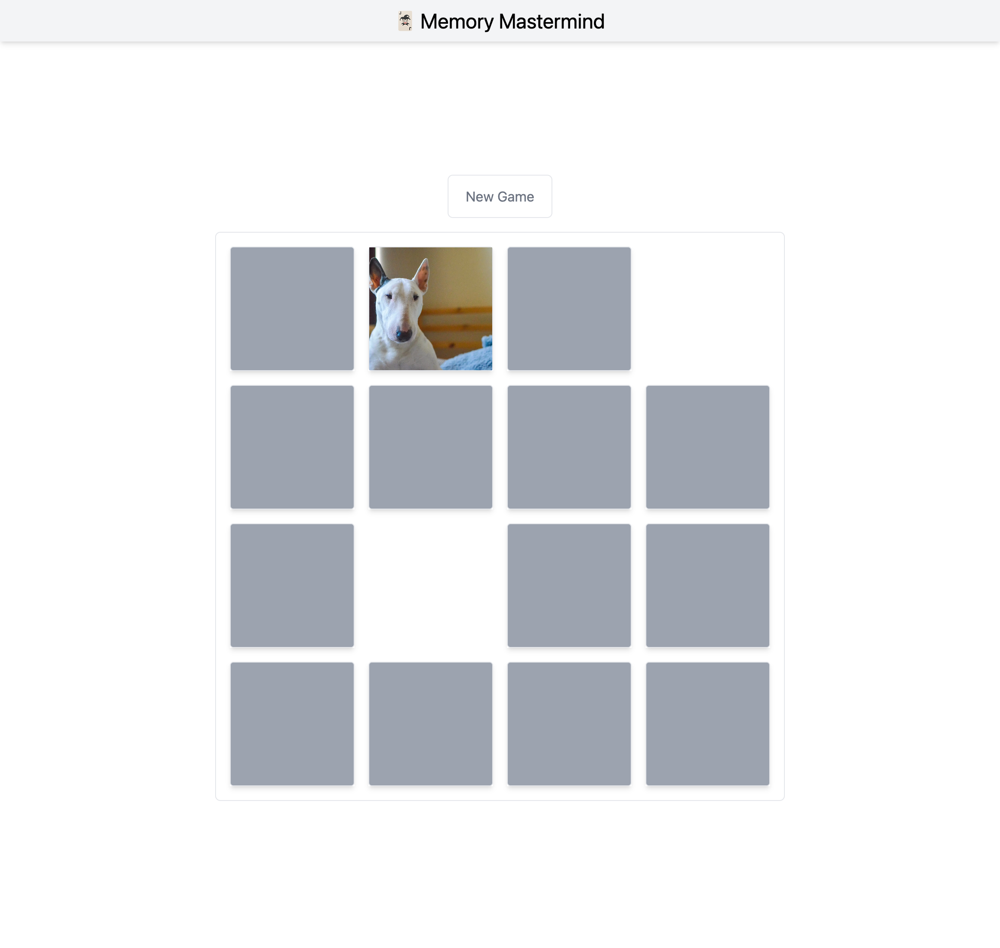

# Memory Mastermind

Memory Mastermind is a web application built using Next.js 13 and Tailwind CSS. It allows users to play a memory game on a single machine. The app tracks the current and end result.

<p align="center">
    
</p>

## Game Instructions

In Memory Mastermind, you must match pairs of cards with the same image. The game consists of a grid of cards, face down. On each turn, the player flips two cards face up. If the cards match, they remain face up. If they don't match, they are flipped back over, and the player continues their turn.

The game continues until all pairs of cards have been matched. The player's score is determined by the number of turns it takes them to match all pairs of cards.

## How to Play

To play Memory Mastermind, follow these steps:

1. Visit the [Memory Mastermind website](https://memory-mastermind.vercel.app/).
2. Change the Level and the Animal type.
3. Click the "Start" button to start a new game.
4. Click on a card to flip it over and reveal the image underneath.
5. Click on another card to flip it over and reveal the image underneath.
6. If the cards match, they will be invisible. If they do not match, they will be flipped back over.
7. Repeat steps until all pairs of cards have been matched.
8. The game is over when all pairs of cards have been matched.
9. Your score will be displayed at the end of the game.

## Getting Started (DEV)

These instructions will get you a copy of the project up and running on your local machine for development and testing purposes.

### Prerequisites

- Node.js
- npm

### Installation

1. Clone the repository

```bash
git clone https://github.com/nagybnc/memory-mastermind.git
```

2. Install the dependencies

```bash
npm install
```

3. Start the development server

```bash
npm run dev
```

## Architecture

Memory Mastermind's architecture is relatively straightforward. It consists of three main components:

1. **Front-end:** The user interface is built using Next.js and Tailwind CSS. The Board layout is implemented using CSS Grid.

2. **Back-end:** The app uses the `pages/api` directory to create serverless API endpoints. Currently, there are two endpoints: `/api/getCatImages` and `/api/getDogImages`, which fetch images of cats and dogs from external APIs.

3. **APIs:** Memory Mastermind uses two external APIs, one for cats and one for dogs. These APIs are used to fetch images of cats and dogs that are displayed on the cards in the game.

## App States

Memory Mastermind needs to keep track of several pieces of state in order to function properly. Here are the main states that the app should have:

1. **Cards**: A collection of cards that the player will match up. Each card should have a unique identifier, an image, and a flag indicating whether it has been matched.

2. **Open Cards**: A collection of cards that the player has currently flipped over. This should be limited to two cards at most.

3. **Cleared Cards**: A collection of cards that the player has successfully matched up.

4. **Moves**: A count of the number of moves the player has made so far. A move consists of flipping over two cards.

5. **Won State**: A flag indicating whether the player has won the game.

## Limitations

As with any software, there are some limitations to Memory Mastermind. Here are a few that you should be aware of:

1. **Single-player only:** Currently, Memory Mastermind only supports single-player mode. Multiplayer mode could be a great addition to the app in the future.

2. **Limited card and level options:** The app currently only uses cat and dog images on the cards. Expanding the number of card options could increase the replay value of the game.

3. **No persistence:** The app does not currently store game progress or high scores. Implementing persistence could allow for a better user experience.

## Next Steps

If you're interested in "productionizing" Memory Mastermind, here are a few potential next steps:

1. **Optimize for performance:** Check Lighthouse to identify and address any performance issues with the app.

2. **Add authentication:** Adding user authentication could allow for a more personalized experience and enable features like game progress tracking and leaderboards.

3. **Realtime Game with Socket.io:**

4. **Expand card options:** Adding more card options, such as images of different animals or famous landmarks, could increase the replay value of the game.

5. **Improve accessibility:** Ensuring that the app is accessible to users with disabilities could increase the app's user base and provide a better experience for all users.

## Questions

<details>
<summary>What was the reason for using Tailwind CSS in your game?</summary>

Tailwind CSS, Styled Components, CSS Modules, and CSS preprocessors are all popular tools for styling your React applications. Each of these tools has its own strengths and weaknesses, and the best choice for your project will depend on your specific needs and requirements. Tailwind CSS is well-suited for quick and efficient styling, Styled Components is well-suited for projects with complex styling requirements, CSS Modules is well-suited for projects with a high level of organization and consistency in their styles, and CSS preprocessors are well-suited for projects with advanced styling needs.

</details>
